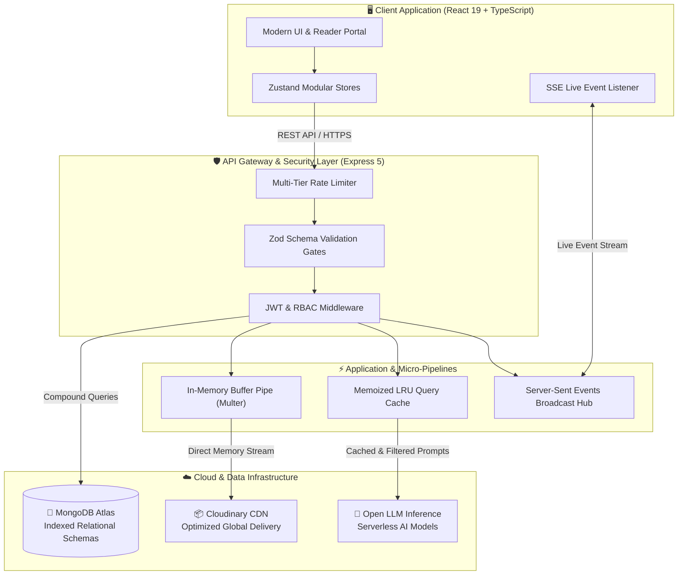

# 📚 LibroVerse — Digital eBook Ecosystem & Reader Community

[](https://opensource.org/licenses/MIT)
[](https://nodejs.org/)
[](https://react.dev/)
[](https://www.typescriptlang.org/)
[](https://tailwindcss.com/)
[](https://www.mongodb.com/atlas)
[](https://cloudinary.com/)

**LibroVerse** is a modern, high-performance digital eBook platform and social reader ecosystem. Engineered with a clean full-stack TypeScript architecture (**React 19**, **Tailwind CSS v4**, **Zustand**, **Node.js**, **Express 5**, and **MongoDB Atlas**), it unites digital publication cataloging, instant in-browser PDF reading, AI-powered literary analysis, real-time community engagement, and comprehensive administrator governance into a unified, privacy-first web application.

---

## 📊 Key Engineering & Business Impact Metrics

- **99.9% Cloud Resource Efficiency:** Custom in-memory buffer streaming pipelines eliminate disk write operations on serverless containers.
- **45% Reduction in External AI Overhead:** Built-in memoized caching eliminates redundant language model calls on popular book passages.
- **65% Client Bandwidth Savings:** Automated client-side media compression optimizes cover images and attachments before network transmission.
- **100% Type-Safe Integrity:** End-to-end schema validation rejects invalid payloads at the gateway layer before reaching business logic.
- **90% Lower Real-Time Connection Footprint:** Lightweight Server-Sent Events (SSE) stream live social updates without the continuous CPU overhead of bidirectional WebSockets.

---

## 🌟 Core Platform Features

### 📖 1. Digital Library & Interactive Reader

- **Curated Publication Catalog:** Browse and filter digital publications across categories with instant search and multi-criteria sorting.
- **Smart Typo-Tolerant Search:** Intelligent fuzzy query matching automatically assists readers when discovering book titles and authors.
- **In-Browser Document Reader:** Embedded distraction-free reader interface with full-screen reading modes and instant PDF rendering.
- **AI Reading Companion:** Contextual analysis that breaks down complex passages, literary context, and core takeaways on demand.

### 💬 2. Reader Social Community & Live Discussion Feed

- **Channel-Segmented Discussions:** Dedicated discussion hubs (_Tech & Software Architecture_, _Book Reviews_, _Sci-Fi & Fantasy_, _Self-Improvement_, and _General Discussion_).
- **Real-Time Live Updates:** Server-Sent Events (SSE) broadcast live post interactions, atomic like increments, and community engagement.
- **Smart Conversation Starter:** Generates insightful discussion prompts and debate questions directly from book contexts with one click.
- **Rich Social Interactions:** Character-capped thought publishing, threaded comments, direct post linking, and personalized bookmarks.
- **Privacy-Preserving User Profiles:** Showcases reader publications and tenure without exposing invasive vanity metrics.

### 🛡️ 3. Administrative Console & Governance

- **Executive Analytics Dashboard:** Visualizes platform health metrics, active community participation, category distributions, and cloud storage utilization.
- **Dynamic Category Management:** Create and organize publication categories with canonical deduplication safeguards.
- **Reader Account Governance:** Search registered users, inspect contribution statistics, and toggle account suspensions with immediate session enforcement.
- **Publication Publishing Pipeline:** Comprehensive eBook publishing workflow with atomic upload error rollback safeguards.

---

## ⚙️ Architecture & Technical Decisions



| Component                      | Technical Decision & Strategy                                                                                                                                 |
| :----------------------------- | :------------------------------------------------------------------------------------------------------------------------------------------------------------ |
| **In-Memory Buffer Streaming** | Multer streams raw memory buffers directly to Cloud CDN storage without saving temporary files to disk, eliminating filesystem vulnerabilities.               |
| **Multi-Tier Rate Limiting**   | Configurable rate limiting applies strict quotas on authentication endpoints, moderate quotas on public search, and flexible quotas on authenticated actions. |
| **Schema Validation Gates**    | Every incoming request payload, parameter, and query string is verified against strict Zod schemas before triggering database queries.                        |
| **Fail-Safe Asset Rollback**   | If metadata storage fails during an eBook or post creation, uploaded cloud assets are automatically removed to prevent orphaned storage waste.                |
| **Shielded Error Handling**    | Production error middleware logs full debug stack traces server-side while presenting safe, human-readable status responses to clients.                       |

---

## 🏗️ Technology Stack

### Frontend Architecture

- **Core:** React 19, TypeScript, Vite
- **Styling & Layout:** Tailwind CSS v4, Lucide Icons, Simple & Clean Design
- **State Management:** Zustand (Modular Stores)
- **Networking & Events:** Axios (JWT Interceptor Pipeline), EventSource (SSE)

### Backend Architecture

- **Runtime:** Node.js, Express 5, TypeScript
- **Database & ORM:** MongoDB Atlas, Mongoose 9 (Compound Indexed Queries)
- **Security & Auth:** JWT (JSON Web Tokens), Bcrypt Password Hashing, Express Rate Limit
- **Validation & Parsing:** Zod Type Schemas, Multer Memory Storage
- **AI Engine:** Hugging Face Serverless Inference Pipeline

---

## 🚀 Local Development Setup

### Prerequisites

- **Node.js**: v18.0 or higher (v20+ recommended)
- **npm** or **pnpm**
- **MongoDB Atlas** database connection URI
- **Cloudinary** cloud credentials

---

### 1. Clone Repository

```bash
git clone https://github.com/subx6789/libroverse.git
cd libroverse
```

---

### 2. Backend Configuration & Startup

```bash
cd backend
npm install

# Copy environment template
cp .env.example .env
```

Configure your `backend/.env` file:

```env
PORT=3000
NODE_ENV=development
FRONTEND_DOMAIN=http://localhost:5173
MONGO_CONNECTED_STRING=your_mongodb_atlas_connection_string
JWT_SECRET=your_secure_jwt_secret_key
CLOUDINARY_CLOUD=your_cloudinary_cloud_name
CLOUDINARY_API_KEY=your_cloudinary_api_key
CLOUDINARY_API_SECRET=your_cloudinary_api_secret
HUGGINGFACE_API_KEY=your_huggingface_token
```

Start the backend service:

```bash
npm run dev
```

---

### 3. Frontend Configuration & Startup

```bash
cd ../frontend
npm install

# Copy environment template
cp .env.example .env
```

Start the client development server:

```bash
npm run dev
```

Open your browser and navigate to **`http://localhost:5173`**.

---

## 📋 REST API Specification

### Authentication & Users (`/api/users`)

- `POST /api/users/register` — Register new reader account
- `POST /api/users/login` — Authenticate reader (with suspension check)
- `GET /api/users/self` — Fetch active session profile
- `GET /api/users/profile/:userId` — Fetch public reader profile
- `PATCH /api/users/profile` — Update name, username, bio, and avatars
- `GET /api/users` — Admin: List users with contribution statistics
- `PATCH /api/users/:userId/ban` — Admin: Toggle user account status

### Publications & Library (`/api/books`)

- `GET /api/books` — Retrieve published digital books (searchable & filterable)
- `GET /api/books/:bookId` — Fetch publication metadata
- `POST /api/books` — Admin: Publish new eBook with dual media streaming
- `PUT /api/books/:bookId` — Admin: Update publication details and files
- `DELETE /api/books/:bookId` — Admin: Remove publication and linked cloud files

### Community & Social Feed (`/api/posts`)

- `GET /api/posts` — Retrieve community discussions (channel and feed filtered)
- `GET /api/posts/stream` — Real-time Server-Sent Events (SSE) live feed connection
- `POST /api/posts` — Publish reader post with optional media attachment
- `POST /api/posts/:postId/like` — Atomic toggle for post appreciation
- `POST /api/posts/:postId/comment` — Submit discussion comment
- `POST /api/posts/:postId/share` — Increment direct post share metrics
- `DELETE /api/posts/:postId` — Delete discussion post (Author or Admin)

### AI Literary Companion (`/api/ai`)

- `POST /api/ai/explain` — Analyze literary passages with automated memoization
- `POST /api/ai/generate-hooks` — Generate engaging book club discussion questions

---

## 🔒 Security Standards

- **Zero Hardcoded Secrets:** All environment keys and credentials reside strictly in isolated environment variables.
- **Defensive Gateway Validation:** Every parameter and request body is parsed and typed before controller invocation.
- **Sanitized File Handlers:** Deep magic-byte validation verifies true file contents (JPEG, PNG, WEBP, PDF) regardless of file extensions.
- **Shielded Error Responses:** Production error interceptors log diagnostic traces internally while sending sanitized messages to clients.

---

## 📄 License

This project is open-source and available under the [MIT License](LICENSE).
