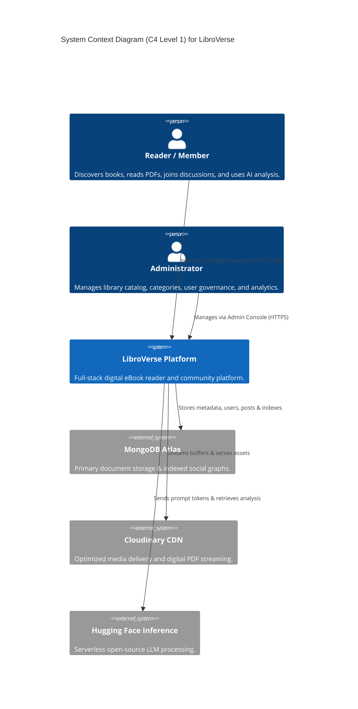
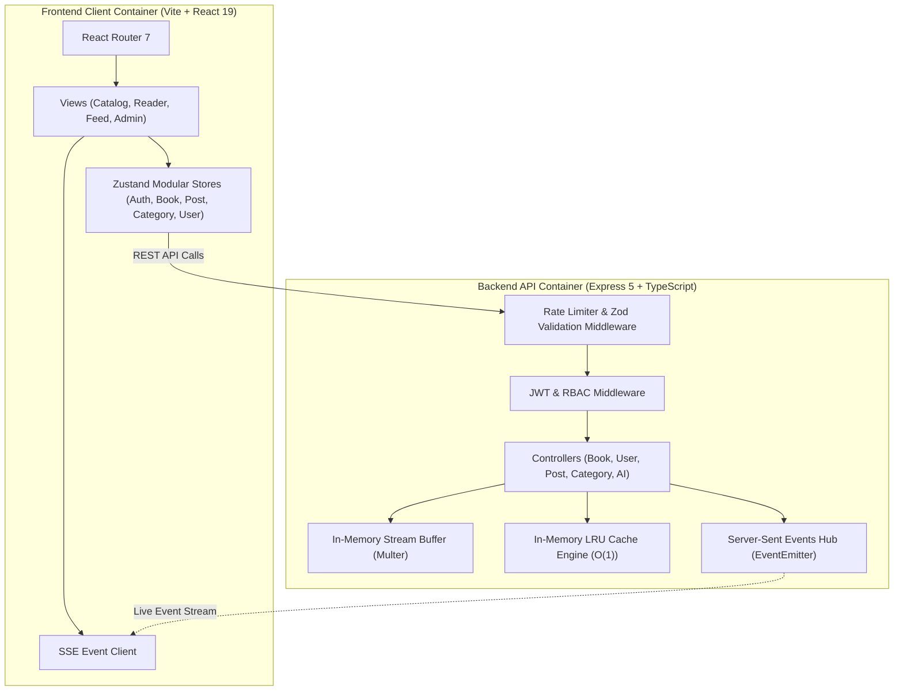
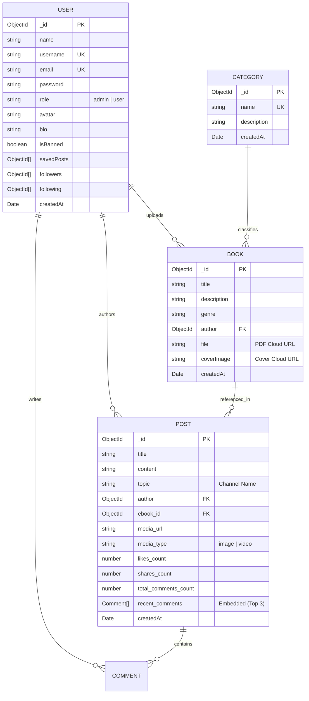
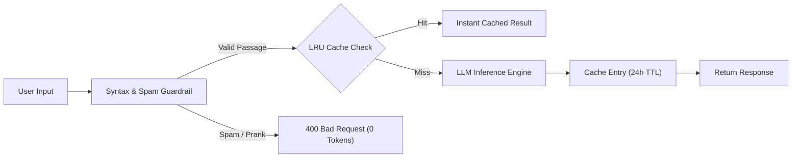

# 📐 System Architecture Document (SAD)

**Document Version:** 1.0.0  
**Architectural Style:** Modular Clean Layered / Event-Driven  

---

## 1. High-Level Architectural Decomposition

LibroVerse is architected using a decoupled **Client-Server & Cloud Services** topology designed for resilience, zero-disk overhead, and high computational efficiency.

---

## 2. Component & Container Architecture (C4 Level 2)

---

## 3. Database Schema & Entity Relationship Diagram (ERD)

---

## 4. Key Architectural Design Patterns

### 4.1 In-Memory Buffer Streaming Pattern
To eliminate disk I/O vulnerabilities and file persistence risks on serverless platforms, all file uploads use `multer.memoryStorage()`. Binary streams are piped directly to CDN storage using NodeJS readable streams:
- Zero temporary files written to the local operating system.
- Memory garbage collection automatically reclaims buffer memory post-upload.

### 4.2 Two-Tier Quality Guardrail & Caching Pattern

### 4.3 Real-Time Server-Sent Events (SSE) Hub
Uses Node.js native `EventEmitter` with persistent HTTP `text/event-stream` connections:
- Dispatches post creations, comment updates, and like counters to all connected clients in real time.
- Emits periodic 25-second keep-alive heartbeats (`:keepalive`) to prevent proxy timeout disconnections.
