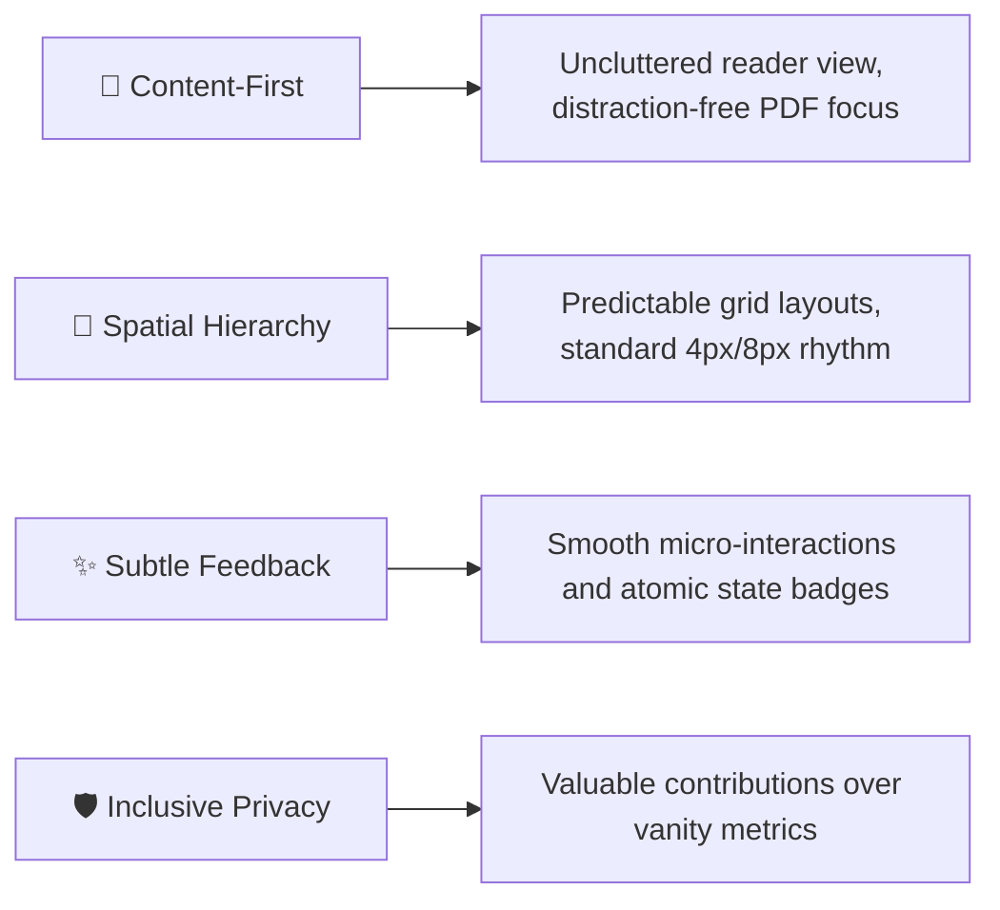
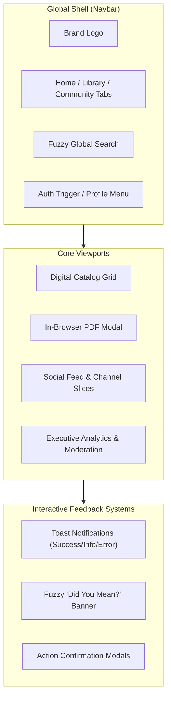

# 🎨 User Interface & Design System Specification (DESIGN)

**Document Version:** 1.0.0  
**Design Philosophy:** Minimalist, Reader-Centric, Content-First  

---

## 1. Design Principles

LibroVerse's interface is crafted to reduce visual fatigue during extended reading sessions while providing intuitive, modern interactions for community engagement and administration.



---

## 2. Color Palette & Semantic Tokens

The design utilizes a tailored color system built with **Tailwind CSS v4** featuring high-contrast neutrals, deep indigos, and purposeful semantic accents:

| Token Name | Hex Value | Semantic Usage |
| :--- | :--- | :--- |
| **Primary Brand** | `#4F46E5` (Indigo-600) | Primary buttons, active navigation indicators, brand iconography. |
| **Primary Dark** | `#4338CA` (Indigo-700) | Button hover states, emphasized headings. |
| **Primary Soft** | `#EEF2FF` (Indigo-50) | Selected filter badges, subtle notification backgrounds. |
| **Neutral Canvas** | `#F8FAFC` (Slate-50) | Application body background, secondary panel fills. |
| **Surface White** | `#FFFFFF` (White) | Content cards, modal backdrops, reader frames. |
| **Border Subtle** | `#E2E8F0` (Slate-200) | Card boundaries, divider lines, form input outlines. |
| **Text Primary** | `#0F172A` (Slate-900) | Primary typography, book titles, author handles. |
| **Text Muted** | `#64748B` (Slate-500) | Secondary metadata, timestamps, character counters. |
| **Success State** | `#10B981` (Emerald-500) | Toast confirmations, active account badges. |
| **Destructive State**| `#E11D48` (Rose-600) | Account suspension triggers, post deletion actions. |

---

## 3. Typography System

Typography pairs modern sans-serif typefaces configured through Google Fonts for readability across desktop and mobile screens:

```
Plus Jakarta Sans  ──────────>  Brand Headers, Feature Titles, Modal Headings
Inter              ──────────>  Body Text, Book Descriptions, Community Posts
JetBrains Mono     ──────────>  Author Handles (@username), Code Snippets, Metadata
```

| Scale | Class / Size | Weight | Line Height | Application |
| :--- | :--- | :--- | :--- | :--- |
| **Display** | `text-2xl` (24px) | `800` (Bold) | `1.25` | Section titles, Hero headings |
| **Title** | `text-lg` (18px) | `700` (Bold) | `1.35` | Book Card titles, Modal headers |
| **Body** | `text-sm` (14px) | `400` / `500` | `1.5` | Publication descriptions, Feed posts |
| **Caption** | `text-xs` (12px) | `500` / `600` | `1.4` | Badges, Timestamps, Subtitles |
| **Micro** | `text-[10px]` (10px)| `700` (Bold) | `1.2` | Channel tags, Admin chips, Counter tags |

---

## 4. Component Architecture & UI Flow



---

## 5. Responsive Breakpoint Strategy

LibroVerse adapts across viewports using standard responsive constraints:

- **Mobile (`< 640px`):** Single-column publication cards, bottom sheet actions, collapsible navigation menus.
- **Tablet (`640px - 1024px`):** Two-column library grid, compact sidebars.
- **Desktop (`> 1024px`):** Four-column library layout, three-column community feed (Channel selector, Main thread, Top contributors widget).
- **Embedded Document Reader:** Fullscreen and adaptive multi-pane layout maintaining fixed readability proportions.
