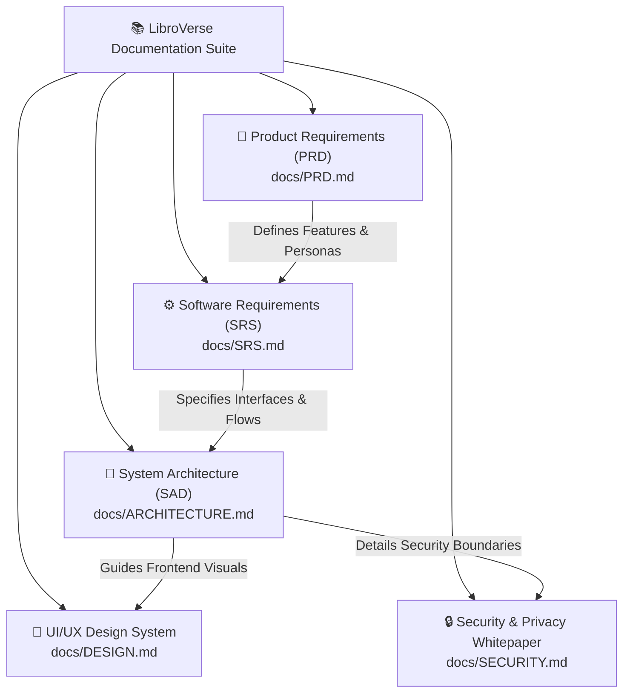

# 📚 LibroVerse Documentation Suite

Welcome to the **LibroVerse** technical and product documentation suite.

---

## 📑 Core Documentation Map

---

## 📋 Document Overview

| Document | Purpose & Scope | Target Audience |
| :--- | :--- | :--- |
| [**PRD.md**](./PRD.md) | **Product Requirements Document:** Executive product vision, user personas, feature breakdown, and business impact metrics. | Product Managers, Stakeholders, Engineering Leads |
| [**SRS.md**](./SRS.md) | **Software Requirements Specification:** IEEE-standard functional requirements, non-functional requirements, and sequence diagrams. | Full-Stack Engineers, QA, System Architects |
| [**ARCHITECTURE.md**](./ARCHITECTURE.md) | **System Architecture Document:** C4 architectural models, database entity-relationship schemas (ERD), and component design patterns. | Technical Leads, DevOps, Cloud Architects |
| [**DESIGN.md**](./DESIGN.md) | **Design System Specification:** Color tokens, typography scales, component layout hierarchy, and responsive breakpoint rules. | Frontend Engineers, UI/UX Designers |
| [**SECURITY.md**](./SECURITY.md) | **Security & Privacy Whitepaper:** Defense-in-depth principles, rate limiting, binary magic-byte file inspection, and data privacy. | Security Auditors, Compliance Teams, Developers |
