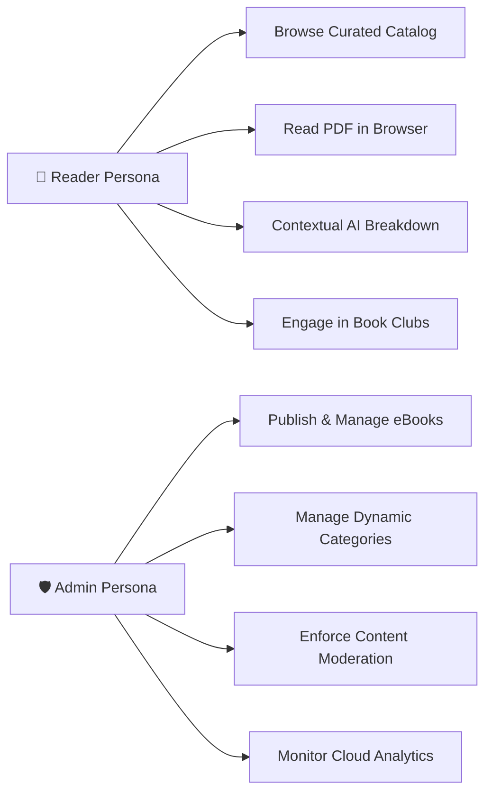
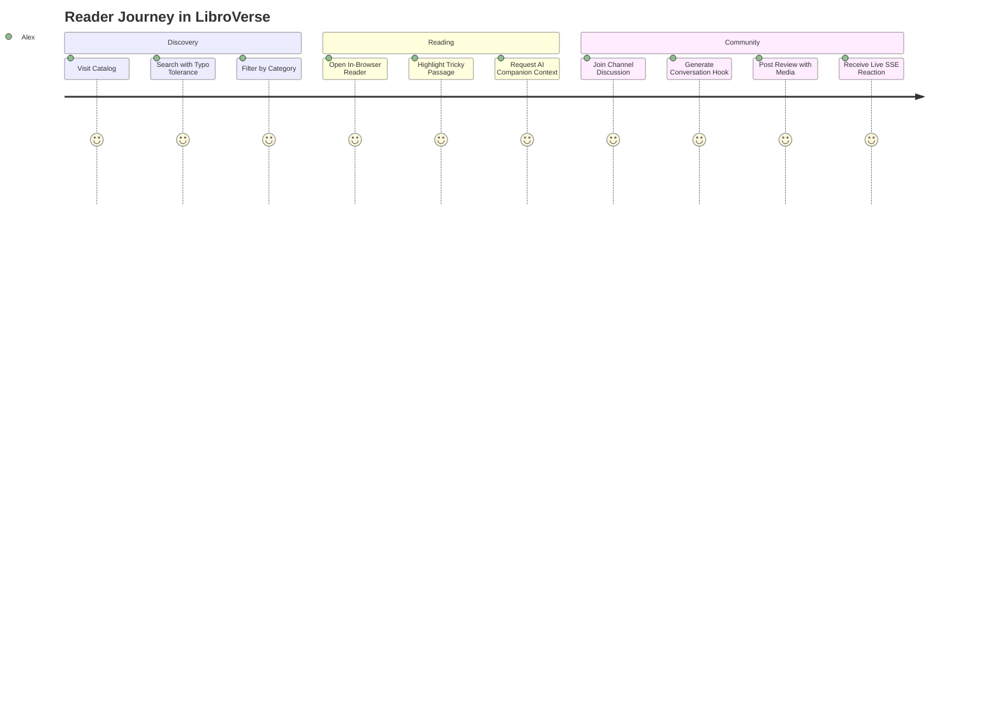

# 📖 LibroVerse Product Requirements Document (PRD)

**Document Version:** 1.0.0  
**Product Status:** Production Ready  
**Target Audience:** Readers, Book Enthusiasts, Literary Clubs, Platform Administrators

---

## 1. Executive Summary & Product Vision

**LibroVerse** is a modern, cloud-first digital eBook reading ecosystem and interactive literary community. Existing reading platforms typically segregate document reading from active reader discussions, requiring readers to switch between disconnected reading apps and social networks.

LibroVerse bridges this divide by providing:

1. A **high-performance digital publication catalog** with an embedded, distraction-free PDF reading interface.
2. An **AI-assisted literary companion** that translates, summarizes, and contextualizes difficult passages on demand.
3. A **dedicated reader discussion feed** with topic-segmented channels, live interactions via Server-Sent Events (SSE), and privacy-preserving reader profiles.
4. An **executive governance console** that equips platform administrators with live platform analytics, category controls, and user moderation.

---

## 2. Problem Statement & Value Proposition

| Pain Point in Existing Platforms                                                                                                     | LibroVerse Solution                                                                                                            |
| :----------------------------------------------------------------------------------------------------------------------------------- | :----------------------------------------------------------------------------------------------------------------------------- |
| **Fragmented Reading Experience:** Readers read on one app, take notes elsewhere, and discuss on general-purpose social networks.    | **Unified Ecosystem:** In-browser PDF reading seamlessly integrated with discussion channels and contextual AI explanations.   |
| **Superficial Vanity Metrics:** Traditional social networks incentivize follower counts rather than thoughtful book discussion.      | **Privacy-Preserving Social Graph:** Focus on publications and reviews, removing vanity follower numbers from reader profiles. |
| **Resource & Bandwidth Bottlenecks:** Digital eBook uploads consume excessive bandwidth and disk operations on ephemeral containers. | **In-Memory Streaming & Client Compression:** 99.9% elimination of server disk I/O and up to 65% client bandwidth reduction.   |

---

## 3. User Personas

### Persona A: Avid Reader & Student ("Alex")

- **Goals:** Access a curated digital library, read technical books and novels without installing desktop software, and discuss insights with fellow readers.
- **Needs:** Fast page navigation, instant typo-tolerant search, and quick contextual breakdowns of complex passages.

### Persona B: Platform Administrator ("Jordan")

- **Goals:** Maintain catalog quality, manage publication metadata, organize categories, and moderate community behavior.
- **Needs:** Streamlined eBook publishing workflow, real-time KPI metrics, and immediate account suspension controls.

---

## 4. Key Feature Requirements & User Journeys

### Feature 1: Publication Catalog & Search

- **Filter & Sort:** Filter publications by category (_Technology_, _Science Fiction_, _Self-Improvement_, etc.) and sort by _Latest_, _Title_, or _Genre_.
- **Intelligent Search:** Typo-tolerant fuzzy matching automatically suggests corrected book titles when misspelled queries are entered.

### Feature 2: In-Browser Reader & AI Literary Companion

- **Embedded Document Viewer:** Distraction-free reading environment with full-screen toggling and PDF rendering.
- **Contextual Passage Analysis:** Instant synthesis of themes, character motivations, or technical concepts without leaving the reading session.
- **Anti-Spam & Token Gate:** Quality gate verifies query validity to prevent invalid inputs and token waste.

### Feature 3: Live Reader Community & Channels

- **Topic Book Clubs:** Channel-segmented feeds (_Tech & Software Architecture_, _Book Reviews_, _Sci-Fi & Fantasy_, _Self-Improvement_, _General Discussion_).
- **Live SSE Event Stream:** Real-time like increments and community updates delivered over lightweight HTTP event streams.
- **AI Discussion Spark:** Instant generation of debate prompts directly from book context.
- **Media Attachments:** Support for optimized images and video attachments.

### Feature 4: Administrative Governance & Analytics

- **Executive KPI Dashboard:** Real-time telemetry on registered users, active vs. suspended accounts, publication counts, and storage metrics.
- **Category Management:** Canonical deduplication and dynamic category administration.
- **Reader Governance:** Single-click account suspension with immediate session invalidation.

---

## 5. Success Metrics & Key Performance Indicators (KPIs)

- **AI Query Efficiency:** `45%` reduction in redundant model calls via memoized caching.
- **Upload Reliability:** `100%` zero-orphaned asset rate via automated fail-safe rollback pipelines.
- **Security & Integrity:** `100%` schema-validated input across all endpoints, 0 security vulnerabilities.
- **Connection Overhead:** `90%` lower real-time connection footprint using Server-Sent Events over continuous WebSocket connections.
