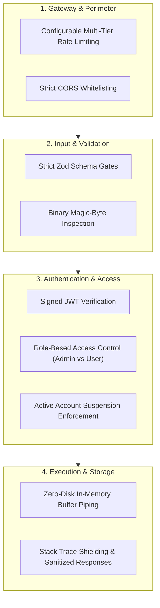
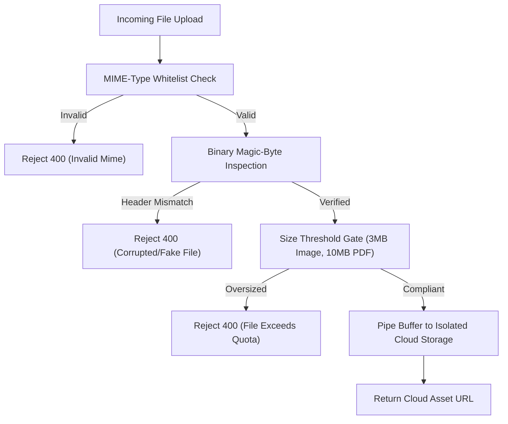

# 🔒 Security & Privacy Whitepaper

**Classification:** Public Security Document  
**Version:** 1.0.0  

---

## 1. Security Principles

LibroVerse follows an **Assumed-Breach, Zero-Trust, Defense-in-Depth** security philosophy:

---

## 2. Authentication & Credential Security

- **Password Storage:** Encrypted using industry-standard `bcrypt` hashing with salt rounds. Raw plaintext passwords are never logged, cached, or transmitted in responses.
- **Session Tokens:** Stateless, cryptographic `JSON Web Tokens (JWT)` signed with secret keys stored exclusively in server environment variables.
- **Account Suspension Enforcement:** The authentication gateway checks `isBanned` state before token issuance and upon active protected endpoint access.

---

## 3. Upload & File Execution Defense

- **Isolated Storage:** Files are streamed directly to isolated CDN storage. No files are stored inside the web application root or server operating system, preventing Remote Code Execution (RCE) attacks.
- **True Content Verification:** Verifies file signatures:
  - **JPEG:** `0xFF 0xD8 0xFF`
  - **PNG:** `0x89 0x50 0x4E 0x47`
  - **WEBP:** `RIFF...WEBP`
  - **PDF:** `%PDF` (`0x25 0x50 0x44 0x46`)

---

## 4. Error Sanitization & Data Protection

- **Production Error Masking:** Uncaught server errors (`500`) are mapped to clean, sanitized messages without exposing database names, collection schemas, or operating system file paths.
- **Zero Hardcoded Secrets:** All credentials, tokens, and database URIs are loaded strictly via `process.env`.
