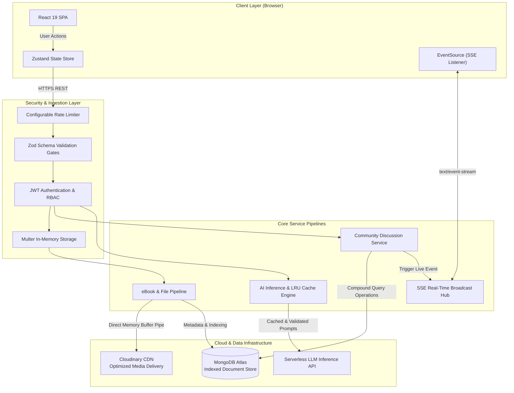
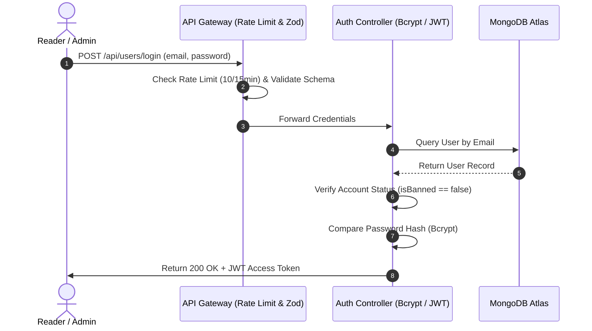
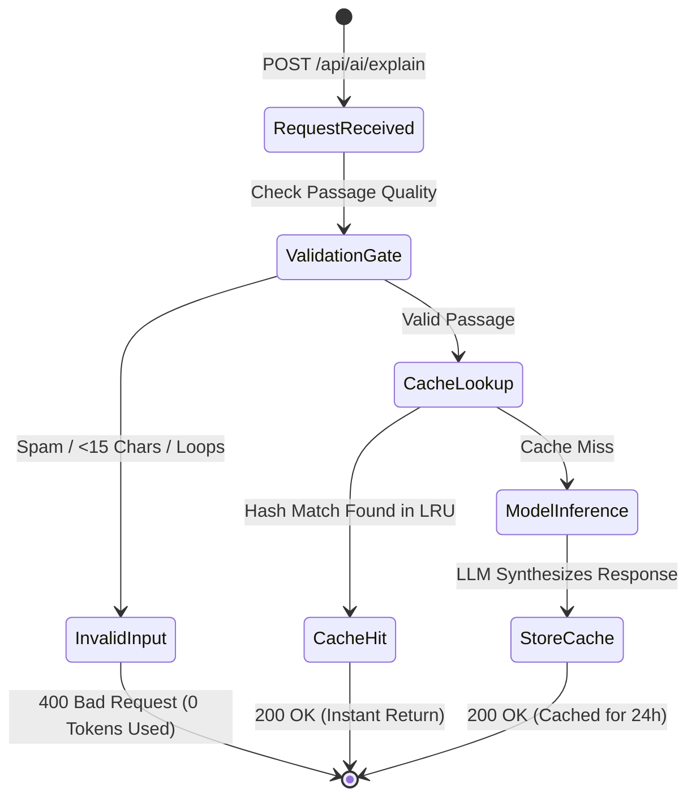

# ⚙️ Software Requirements Specification (SRS)

**Document Version:** 1.0.0  
**Status:** Approved for Production  
**Standard:** IEEE 830 Standard Format  

---

## 1. Introduction

### 1.1 Purpose
This document provides the formal software requirements specification for the **LibroVerse** digital eBook ecosystem. It details external interfaces, functional behaviors, system performance thresholds, and security controls.

### 1.2 Scope
LibroVerse delivers a secure, cloud-enabled web application that supports:
- End-to-end user authentication and role-based access control (RBAC).
- Digital eBook publication management and in-browser reading.
- Contextual AI passage analysis and discussion spark generation.
- Real-time community engagement via Server-Sent Events (SSE).
- Executive analytics and user moderation.

---

## 2. Overall System Architecture & Data Flow

---

## 3. Functional Requirements

### 3.1 Authentication & Authorization Module (AUTH)

- **REQ-AUTH-01:** System shall enforce configurable rate limits on `/api/users/login` and `/api/users/register` (default: 10 attempts per 15-minute window).
- **REQ-AUTH-02:** Passwords must be hashed using industry-standard bcrypt with a work factor of 10.
- **REQ-AUTH-03:** Suspended accounts must be rejected at the authentication gateway with an immediate `403 Forbidden` error.
- **REQ-AUTH-04:** Access tokens must use signed JWT with an expiration of 7 days.

---

### 3.2 Publication & In-Memory Streaming Module (BOOK)

- **REQ-BOOK-01:** Only users with the `admin` role shall be authorized to publish, update, or delete eBooks.
- **REQ-BOOK-02:** System shall enforce binary magic-byte inspection on all uploaded covers (JPEG, PNG, WEBP) and documents (`%PDF` header).
- **REQ-BOOK-03:** Uploads must be streamed directly from RAM memory buffers (`multer.memoryStorage`) to cloud storage without writing temporary files to the web server filesystem.
- **REQ-BOOK-04:** If database insertion fails after asset upload, the system must trigger an atomic rollback to remove orphaned cloud files.

---

### 3.3 AI Literary Companion & Discussion Generator (AI)

- **REQ-AI-01:** System shall validate passage inputs against quality guardrails ($\ge 15$ chars, $\ge 3$ distinct words, non-repetitive tokens) before initiating LLM calls.
- **REQ-AI-02:** System shall utilize an in-memory LRU Cache (Capacity: 200 items, TTL: 24 hours) to eliminate redundant model inference.
- **REQ-AI-03:** Fallback mechanisms must seamlessly handle provider downtime without degrading core application workflows.

---

### 3.4 Real-Time Community Feed Module (COMMUNITY)

- **REQ-COM-01:** System shall provide real-time updates via Server-Sent Events (`/api/posts/stream`) with automatic 25-second keep-alive heartbeats.
- **REQ-COM-02:** Community posts must strictly belong to predefined channels (`General Discussion`, `Book Reviews & Ratings`, `Tech & Software Architecture`, `Science Fiction & Fantasy`, `Self-Improvement & Habits`).
- **REQ-COM-03:** Post content must respect a hard ceiling of 500 characters, and comments must respect a 300-character ceiling.
- **REQ-COM-04:** User profiles must display contributions, bio, and joined date while keeping private relation data unexposed.

---

## 4. Non-Functional Requirements (NFRs)

| ID | Category | Requirement Specification |
| :--- | :--- | :--- |
| **NFR-01** | **Performance** | In-memory cached responses and catalog searches must return with sub-100ms response times. |
| **NFR-02** | **Scalability** | Event-driven SSE broadcast architecture must support concurrent client connections with minimal CPU overhead. |
| **NFR-03** | **Reliability** | Production error handling must shield database internals and stack traces from client exposure. |
| **NFR-04** | **Data Integrity** | Compound database indexes `{ topic: 1, createdAt: -1 }` and `{ createdAt: -1 }` must guarantee strict chronological query ordering. |
| **NFR-05** | **Security** | 100% of environment secrets must be isolated from repository source code and frontend client bundles. |
